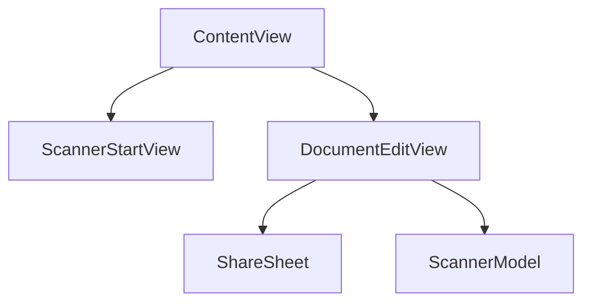

# ScanCutter 📄✂️

一款简洁高效的文档扫描与处理工具，基于 [VisionKit](https://developer.apple.com/documentation/visionkit) 和 SwiftUI 构建。

## 功能特性 ✨

- **多页扫描** - 支持连续扫描多个文档页面
- **网格预览** - 以瀑布流形式展示所有扫描件
- **剪贴板操作** - 点击即可复制单张扫描件到剪贴板
- **共享表单** - 长按即可进一步共享

## 快速开始 🚀

### 要求
- iOS 17.2+
- 支持文档扫描的 iOS 设备

### 安装
在AppStore搜索‘ScanCutter’进行下载。

### 使用指南
1. **扫描文档** 📸  
   点击"开始扫描"按钮启动系统文档扫描器

2. **浏览内容** 👀  
   扫描后的文档会以网格形式展示（参见代码块：`DocumentEditView.swift` 18-48行）

3. **快速操作** ⚡  
   - 点击图片自动复制到剪贴板
   - 长按图片调出分享菜单
   - 使用工具栏继续添加或清除扫描件

4. **数据管理** 🗑️  
   通过"返回"按钮可一键清除所有扫描记录（含确认对话框，参见代码块：`DocumentEditView.swift` 51-69行）

## 架构设计 🏗️

## 贡献指南 🤝

欢迎通过 Issue 和 Pull Request 参与贡献！  
请确保：
1. 遵循现有代码风格（SwiftLint 规则待补充）
2. 为新功能添加单元测试
3. 更新相关文档

## 许可证 📜

本项目采用 [MIT License](LICENSE)

## 致谢 🙏

- Apple 提供的 [VisionKit](https://developer.apple.com/documentation/visionkit) 框架
- SwiftUI 声明式 UI 框架
- 图标由 [Icons8](https://icons8.com) 提供
